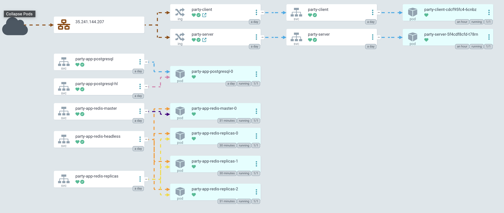

# 🎉 Party – Helm & Kubernetes Deployment Guide

This Helm chart deploys the Party application on Kubernetes using:

- **Google Secret Manager** (via External Secrets Operator)
- **GHCR** for container registry
- **Ingress NGINX** for external access

## 📁 Project Structure

```plaintext
infra/
├── helm/
│   └── party/
│       ├── Chart.yaml
│       ├── templates/
│       ├── values.yaml
│       ├── values.secret.yaml   # (gitignored)
├── terraform/                   # GCP infra + ESO secret provisioning
├── argo/
│   └── application.yaml         # Argo CD App config
```

## 🚀 Deployment Workflow

### ✅ 0. Prerequisites

- GCP project with Secret Manager API enabled
- GKE cluster provisioned (via Terraform)
- Terraform installed and configured
- Helm installed
- kubectl connected to your cluster

### 1️⃣ [Optional] Terraform – Create Secrets & ESO Service Account

From `infra/terraform`:

```bash
terraform init
terraform apply
```

Export the service account key:

```bash
terraform output -raw eso_reader_key > eso-creds.json 
```

Decode the key to view its contents:

```bash
cat eso-creds.json | base64 --decode | jq .
```

### 2️⃣ External Secrets Operator (ESO)

#### a. Create the GCP Credentials Secret

```bash
kubectl create namespace external-secrets

kubectl create secret generic eso-gcp-creds \
  --from-file=credentials.json=eso-creds.json \
  -n external-secrets
```

#### b. Install ESO via Helm

```bash
helm repo add external-secrets https://charts.external-secrets.io
helm repo update

helm install external-secrets external-secrets/external-secrets \
  -n external-secrets \
  --create-namespace \
  --set installCRDs=true
```

### 3️⃣ SecretStore & ExternalSecret

> ⚠️ These resources are already included in `infra/helm/party/templates/` and will be installed via Helm in step 6. **Do not apply manually.**

### 4️⃣ Ingress Controller

If you don't already have an Ingress Controller:

```bash
helm repo add ingress-nginx https://kubernetes.github.io/ingress-nginx
helm repo update

helm install ingress-nginx ingress-nginx/ingress-nginx \
  --namespace ingress-nginx --create-namespace
```

### 5️⃣ GHCR Access

Create the Docker Secret to pull the image from GitHub Container Registry:

```bash
kubectl create ns party

kubectl create secret docker-registry ghcr-credentials \
  --docker-server=https://ghcr.io \
  --docker-username=YOUR_GITHUB_USERNAME \
  --docker-password=YOUR_GITHUB_PAT \
  --docker-email=dummy@example.com \
  --namespace=party
```

> ℹ️ The GitHub PAT must have the `read:packages` scope.

### 6️⃣ Deploy Party via Helm

```bash
cd infra/helm/party

helm dependency update

helm install party-app . \
  --namespace party \
  --create-namespace
```

### 7️⃣ Upgrade the Release

```bash
helm upgrade party-app . \
  --namespace party \
  -f values.yaml -f values.secret.yaml
```

## 🔐 Security

- `values.secret.yaml` must **never** be committed.
- Secrets are managed centrally in Google Secret Manager.
- Access is controlled by a GCP Service Account with the `roles/secretmanager.secretAccessor` role, whose key is injected via `eso-gcp-creds`.

## ✅ Verification

- `kubectl get externalsecret -n party` → should show `Ready`
- `kubectl get secret party-secrets -n party` → should exist
- Argo CD UI accessible (via port-forward or Ingress)
- Ingress correctly exposes the app (according to `.Values.ingress.host`)

## 📝 Screenshots

> 🦑 Argo CD UI
